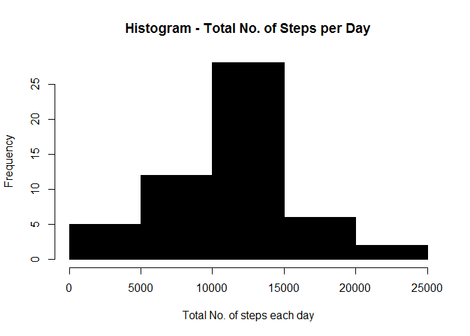
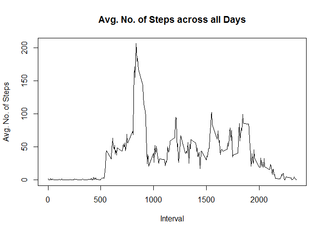
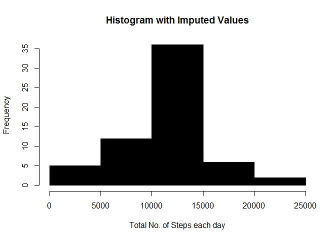

=====================================================


## Loading and preprocessing the data
##Assuming that the file is already unzipped in the local folder

```r
data <- read.csv("activity.csv",header=T)
```


## What is mean total number of steps taken per day?

```r
data_trim <- na.omit(data) # Considering only complete cases
steppday <- aggregate(steps ~ date, data_trim, sum) #calculating total steps per day
hist(steppday$steps,col=1,main="Histogram - Total No. of Steps per Day",xlab="Total No. of steps each day")
```

 
## Mean & Median of Total No. of Steps taken per Day

```r
sprintf("Mean Value for Total No. of Steps per Day is")
```

```
## [1] "Mean Value for Total No. of Steps per Day is"
```

```r
mean(as.numeric(steppday$steps))
```

```
## [1] 10766.19
```

```r
sprintf("Median Value for Total No. of Steps per Day is")
```

```
## [1] "Median Value for Total No. of Steps per Day is"
```

```r
median(as.numeric(steppday$steps))
```

```
## [1] 10765
```


## What is the average daily activity pattern?

```r
int_steps <- aggregate(steps ~ interval, data_trim, mean) #Calculating Steps with respect to interval and summing them up
plot(int_steps$interval,int_steps$steps,type='l',col=1,main="Avg. No. of Steps across all Days",xlab="Interval",ylab="Avg. No. of Steps")
```

 
## Interval with Max. No. of Steps across all the Days

```r
max_steps_int <- int_steps[which.max(int_steps$steps),] ##Finding row with max interval
sprintf("Max Interval is")
```

```
## [1] "Max Interval is"
```

```r
as.numeric(max_steps_int$interval)
```

```
## [1] 835
```

```r
sprintf("-")
```

```
## [1] "-"
```

```r
as.numeric(max_steps_int$interval)+5
```

```
## [1] 840
```

```r
sprintf("Max steps in this interval is")
```

```
## [1] "Max steps in this interval is"
```

```r
as.numeric(max_steps_int$steps)
```

```
## [1] 206.1698
```


## Imputing missing values

```r
data_na <- data[!complete.cases(data),] ##Rows with NAs
nrow(data_na)
```

```
## [1] 2304
```
##Impute Mean for NA Values of the 5-min interval

```r
for(i in 1:nrow(data)){
        if(is.na(data$steps[i])){
                int_val <- data$interval[i]
                rid <- which(int_steps$interval==int_val)
                steps_val <- int_steps$steps[rid]
                data$steps[i] <- steps_val
        }
} 
```
##Aggregate Steps with respect to date

```r
imputed_steps <- aggregate(steps ~ date,data,sum)
```
##Creating Histogram with Imputed Values

```r
hist(imputed_steps$steps,col=1,main="Histogram with Imputed Values",xlab="Total No. of Steps each day")
```

 
##Calcuating Mean & Median for Original Data Set and Data Set with Imputed Values

```r
mean(steppday$steps)
```

```
## [1] 10766.19
```

```r
median(steppday$steps)
```

```
## [1] 10765
```

```r
mean(imputed_steps$steps)
```

```
## [1] 10766.19
```

```r
median(imputed_steps$steps)
```

```
## [1] 10766.19
```
* Though the Means remain the same due to imputation, there is minor difference (by 1) in Median


## Are there differences in activity patterns between weekdays and weekends?

